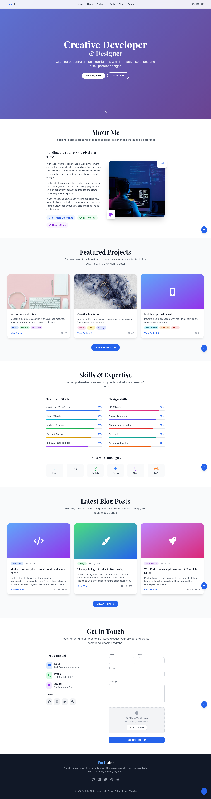

# Liziwe Mkosana - Professional Accounting & Finance Portfolio



A professional, fully-responsive portfolio website for Liziwe Mkosana, an experienced accounting specialist and financial manager. This project showcases 10+ years of expertise in accounts payable operations, bookkeeping, financial management, and audit compliance with modern design elements, interactive animations, and optimized user experience.

## ✨ Features

- **Responsive Design**: Mobile-first approach optimized for employers and recruiters across all devices
- **Modern UI**: Professional gradient backgrounds, glassmorphism effects, and smooth animations
- **Interactive Elements**: 
  - Scroll-triggered animations and reveal effects
  - Animated skill bars showing proficiency in accounting systems (Pastel, QuickBooks, Navision)
  - Professional achievement cards with detailed metrics
  - Dynamic navigation with active state tracking
- **Professional Showcase**: 
  - 10+ years of accounting experience highlighted
  - Detailed professional achievements with quantifiable results
  - Certification and qualification sections
  - Multi-system financial proficiency demonstration
- **Performance Optimized**: Fast loading, efficient animations, and minimal dependencies
- **SEO Ready**: Complete meta tags, structured data, and semantic HTML for professional discoverability
- **Accessibility**: ARIA attributes, keyboard navigation, and proper contrast ratios
- **Contact Form**: Professional inquiry form with validation
- **Professional Integration**: Links to LinkedIn, certifications, and professional profiles

## 🛠️ Tech Stack

- **HTML5**: Semantic markup with proper structure
- **Tailwind CSS 3.4.16**: Utility-first styling without custom CSS files
- **Vanilla JavaScript**: No frameworks, just clean, efficient JS
- **Font Awesome 6.0.0**: Icon library for UI elements
- **Google Fonts**: Poppins (headings) and Inter (body text)
- **Intersection Observer API**: For scroll-based animations
- **JSON-LD**: Structured data for SEO

## 📋 Project Structure

```
/
├── index.html          # Main single-page portfolio application
├── README.md           # Project documentation (this file)
├── sitemap.xml         # XML sitemap for SEO and search engine discovery
└── screenshot_f011.png # Portfolio preview image

Sections Included:
├── Hero Section        # Professional introduction and value proposition
├── About Me           # Professional background and expertise summary
├── Professional Achievements  # Notable career accomplishments and metrics
├── Skills & Expertise  # Accounting, finance, and systems proficiency
├── Certifications     # Professional qualifications and training
└── Contact            # Professional contact information and inquiry form
```

## 🚀 Getting Started

### Prerequisites

- A modern web browser (Chrome, Firefox, Safari, or Edge)
- Basic understanding of HTML, CSS, and JavaScript if you plan to customize

### Installation & Setup

This is a static website with no build process required. To get it running locally:

1. **Clone the repository**
   ```bash
   git clone https://github.com/yourusername/portfolio-website.git
   cd portfolio-website
   ```

2. **Open in a browser**
   - You can simply open the `index.html` file in your browser
   - Alternatively, use a local development server:

#### Using Python's built-in server:
```bash
# Python 3
python -m http.server

# Python 2
python -m SimpleHTTPServer
```
Then visit: `http://localhost:8000`

#### Using Node.js with http-server:
```bash
# Install http-server globally if you haven't already
npm install -g http-server

# Run the server
http-server
```
Then visit: `http://localhost:8080`

#### Using VS Code Live Server extension:
1. Install the "Live Server" extension
2. Right-click on `index.html` and select "Open with Live Server"

## 🎨 Customization

### Personal Information

To customize this portfolio with your information:

1. **Update Profile Details**:
   - Edit name, job title, and professional description in the hero section
   - Update professional summary and key achievements in about me section
   - Replace profile image with your professional headshot
   - Update contact information (email, phone, location)

2. **Professional Achievements** (Replaces Projects):
   - Update descriptions of major professional accomplishments
   - Modify metrics showing impact (invoice processing volume, error reduction %, audit compliance)
   - Update company names and employment dates
   - Include relevant accounting systems and processes used

3. **Skills & Proficiency**:
   - Adjust skill percentages based on your expertise
   - Add accounting-specific competencies (AP, AR, reconciliation, audit, etc.)
   - Update list of accounting platforms (Pastel, QuickBooks, Navision, Sage One, etc.)
   - Include industry certifications and qualifications

4. **Certifications Section**:
   - Add your professional certifications and qualifications
   - Include dates obtained and issuing organizations
   - Add relevant accounting and finance certifications (CPA, ACCA, CA, etc.)

5. **Contact Information**:
   - Update email, phone, and location in contact section
   - Replace social media links with your professional profiles (LinkedIn, professional networks)
   - Add links to certification databases or professional registries

6. **SEO and Metadata**:
   - Update title, description, and keywords in the `<head>` section to reflect accounting focus
   - Modify JSON-LD structured data with your professional information
   - Update keywords to include: accountant, bookkeeper, accounts payable, financial manager, etc.

### Styling Customization

The project uses Tailwind CSS via CDN. To modify the styling:

1. **Color Scheme**:
   - Edit gradient colors in CSS variables and Tailwind classes
   - Update accent colors in buttons and interactive elements

2. **Typography**:
   - Change fonts by updating Google Fonts import and font-family classes
   - Adjust text sizes, weights, and colors using Tailwind classes

3. **Layout**:
   - Modify container widths, spacing, and grid layouts
   - Adjust responsive breakpoints for different screen sizes

## 📱 Responsive Design

The portfolio is built with a mobile-first approach and includes:

- Responsive navigation with mobile hamburger menu
- Flexible grid layouts that adapt to screen size
- Optimized images and content spacing for mobile
- Touch-friendly interactive elements

## 🔍 SEO Optimization

This project includes:

- Complete meta tags (title, description, Open Graph, Twitter Cards)
- Structured data (JSON-LD) for better search engine representation
- Semantic HTML structure
- XML sitemap for search engine indexing
- Proper heading hierarchy and content organization

## ⚡ Performance Considerations

For optimal performance:

- Images are optimized for web with appropriate dimensions
- CSS animations use hardware acceleration
- JavaScript is optimized with efficient DOM queries
- External resources use CDN delivery
- Lazy loading is implemented for images and animations

## 💻 Backend Integration Options

While this is currently a static frontend portfolio, it can be easily integrated with:

1. **Form Handling**:
   - Netlify Forms
   - FormSpree
   - AWS Lambda or other serverless functions

2. **Content Management**:
   - Headless CMS (Contentful, Sanity, Strapi)
   - Markdown files with a static site generator

3. **Authentication** (if needed):
   - Auth0
   - Firebase Authentication
   - Custom JWT solution

## 🌐 Deployment Options

This site can be easily deployed to:

- **GitHub Pages**: Free and easy for static sites
- **Netlify**: Great for form handling and continuous deployment
- **Vercel**: Excellent performance and free tier
- **AWS S3 + CloudFront**: Enterprise-grade solution
- **Any static hosting provider**

## 🔄 Browser Compatibility

Tested and compatible with:

- Chrome 80+
- Firefox 75+
- Safari 13+
- Edge 80+
- iOS Safari 13+
- Chrome for Android 80+

## 🔧 Troubleshooting

Common issues and solutions:

- **CSS not loading**: Ensure you have internet connection for CDN resources
- **Animations not working**: Check if JavaScript is enabled in your browser
- **Form submission issues**: The form is currently simulation-only and needs backend integration
- **Mobile menu not opening**: Check for JavaScript console errors

## 📝 License

This project is licensed under the MIT License - see the LICENSE file for details.

## 🤝 Contributing

Contributions, issues, and feature requests are welcome. Feel free to check issues page if you want to contribute.

## 📧 Contact

For any questions, professional inquiries, or partnership opportunities, please contact:
- Email: mkosanaliziwe@gmail.com
- Phone: +27632973710
- Location: Johannesburg, Gauteng, South Africa
- LinkedIn: [Your LinkedIn Profile]

---

Portfolio for **Liziwe Mkosana**  
Professional Accountant | Financial Specialist | Accounts Payable & Bookkeeping Expert  
10+ Years of Financial Excellence

Made with ❤️ by Liziwe Mkosana